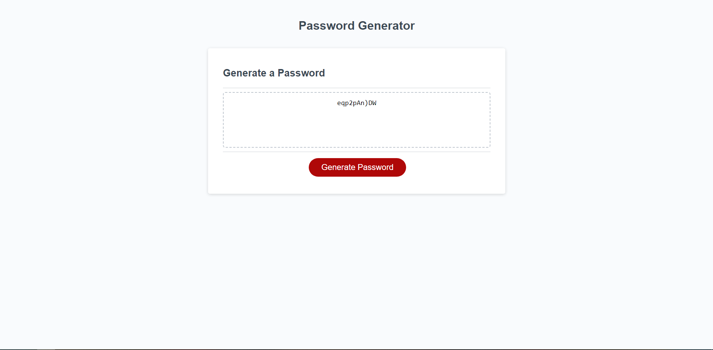

# Challange 3 Java Script 
The challenge required students to modify starter code to create an application that enables employees to generate random passwords based on criteria that they’ve selected.

The html shows a page called called Password Generator which runs a few promts to generate a random password 
CSS files were used for site accessabilty and looks. Java Script files were used to ensure the page ran correctly

  Contents:
    - HTML File
    - Assets Folder
      - Images
      - CSS
      - Java Script

The HTML file should be accessable from the https link: https://ryanzade.github.io/Challange-3/

RyanZade
